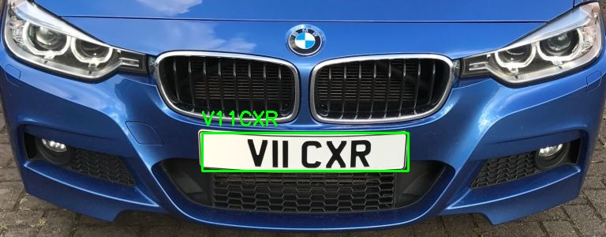

🚗 License Plate Detection and OCR System

This project detects vehicle license plates from images and extracts the license number using Optical Character Recognition (OCR).

It combines YOLOv8 object detection for locating license plates and OCR for reading the text from detected regions.

✨ Features

Automatic license plate detection

OCR-based text extraction

Image testing pipeline

Works on custom input images

Modular and easy-to-run scripts

🧠 Technologies Used

Python

YOLOv8 (Ultralytics)

OpenCV

NumPy

Matplotlib

easyocr

📂 Project Structure

```
project/
│
├── models/              # model configs or small files
├── test/                # testing utilities
│
├── license_detector.ipynb
├── ocr_recognition.py
├── requirements.txt
└── README.md
```


⚙️ Installation

Clone the repository:

git clone https://github.com/your-username/your-repo-name.git
cd your-repo-name

Install dependencies:

pip install -r requirements.txt


▶️ How to Run

Run OCR detection script:

python ocr_recognition.py

Provide input image path inside the script or notebook.

📊 Output

The system:

Detects license plate region

Extracts plate area

Applies OCR

Displays recognized license number

📁 Dataset

Dataset is not included in this repository.

You can use any vehicle image dataset or your own custom images for testing.

🔧 Model

Uses YOLOv8 pretrained weights for license plate detection.

## 📸 Sample Output


